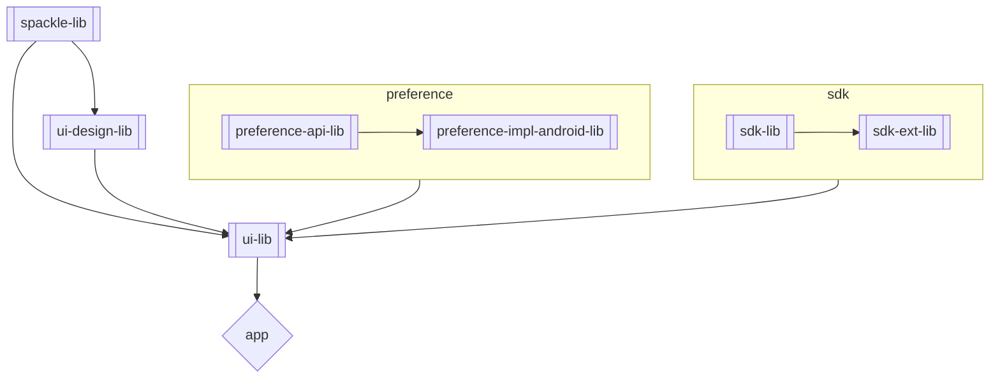

# Design and Architecture
_Note: This document will continue to be updated as the app is implemented._

# Gradle
 * Versions are declared in [gradle.properties](../gradle.properties).  There's still enough inconsistency in how versions are handled in Gradle, that this is as close as we can get to a universal system.  A version catalog is used for dependencies and is configured in [settings.gradle.kts](../settings.gradle.kts), but other versions like Gradle Plug-ins, the NDK version, Java version, and Android SDK versions don't fit into the version catalog model and are read directly from the properties
 * Much of the Gradle configuration lives in [build-convention](../build-convention/) to prevent repetitive configuration as additional modules are added to the project
 * Build scripts are written in Kotlin, so that a single language is used across build and the app code bases
 * Only Gradle, Google, and JetBrains plug-ins are included in the critical path.  Third party plug-ins can be used, but they're outside the critical path.  For example, the Gradle Versions Plugin could be removed and wouldn't negatively impact local building, testing, or releasing the app
 * Repository restrictions are enabled in [build-convention](../build-convention/settings.gradle.kts), [settings.gradle.kts](../settings.gradle.kts), and [build.gradle.kts](../build.gradle.kts) to reduce likelihood of pulling in an incorrect dependency.  If adding a new dependency, these restrictions may need to be changed otherwise an error that the dependency cannot be found will be displayed

# Multiplatform
While this repository is for an Android application, efforts are made to give multiplatform flexibility in the future.  Specific adaptions that are being made:
 * Where possible, common code is extracted into multiplatform modules
 * In UI state management code, Kotlin Flow is often preferred over Android LiveData and Compose State to grant future flexibility
 * Saver is preferred over @Parcelize for objects in the SDK

Note: test coverage for multiplatform modules behaves differently than coverage for Android modules.  Coverage is only generated for a JVM target, and requires running two tasks in sequence: `./gradlew check -PIS_COVERAGE_ENABLED=true; ./gradlew jacocoTestReport -PIS_COVERAGE_ENABLED=true`

# App
The main entrypoints of the application are:
 * [AppImpl.kt](../app/src/main/java/cash/z/ecc/app/AppImpl.kt) - The root Application object defined in the app module
 * [MainActivity.kt](../ui-lib/src/main/java/cash/z/ecc/ui/MainActivity.kt) - The main Activity, defined in ui-lib.  Note that the Activity is NOT exported.  Instead, the app module defines an activity-alias in the AndroidManifest which is what presents the actual icon on the Android home screen.

# Modules
The logical components of the app are implemented as a number of Gradle modules.

 * `app` — Compiles all of the modules together into the final application.  This module contains minimal actual code.  Note that the Java package structure for this module is under `cash.z.ecc.app` while the Android package name is `cash.z.ecc`.
 * `build-info-lib` — Collects information from the build environment (e.g. Git SHA, Git commit count) and compiles them into the application.  Can also be used for injection of API keys or other secrets.
 * ui
     * `ui-design` — Contains UI theme elements only.  Besides offering modularization, this allows for hiding of some Material Design components behind our own custom components.
     * `ui-lib` — User interface that the user interacts with.  This contains 99% of the UI code, along with localizations, icons, and other assets.
 * preference
     * `preference-api-lib` — Multiplatform interfaces for key-value storage of preferences.
     * `preference-impl-android-lib` — Android-specific implementation for preference storage.
 * `sdk-ext-lib` — Contains extensions on top of the to the Zcash SDK.  Some of these extensions might be migrated into the SDK eventually, while others might represent Android-centric idioms.  Depending on how this module evolves, it could adopt another name such as `wallet-lib` or be split into two.
 * `spackle-lib` — Random utilities, to fill in the cracks in the Kotlin and Android frameworks.

The following diagram shows a rough depiction of dependencies between the modules.  Two notes on this diagram:
 * `sdk-lib` is in a [different repository](https://github.com/zcash/zcash-android-wallet-sdk)
 * Although effort goes into ensuring this diagram stays up-to-date, Gradle build files are the authoritative source on dependencies

# Test Fixtures
Until the Kotlin adopts support for fixtures, fixtures live within the main source modules.  These fixtures make it easy to write automated tests, as well as create Compose previews.  Although these fixtures are compiled into the main application, they should be removed by R8 in release builds.

# Shared Resources
There are some app-wide resources that share a common namespace, and these should be documented here to make it easy to ensure there are no collisions.

* SharedPreferences
    * "co.electriccoin.zcash.encrypted" is defined as a preference file in `EncryptedPreferenceSingleton.kt`
* Databases
    * Some databases are defined by the SDK
* Notification IDs
    * No notification IDs are currently defined
* Notification Channels
    * No notification channels are currently defined
* WorkManager Tags
    * "co.electriccoin.zcash.background_sync" is defined in `WorkIds.kt`
