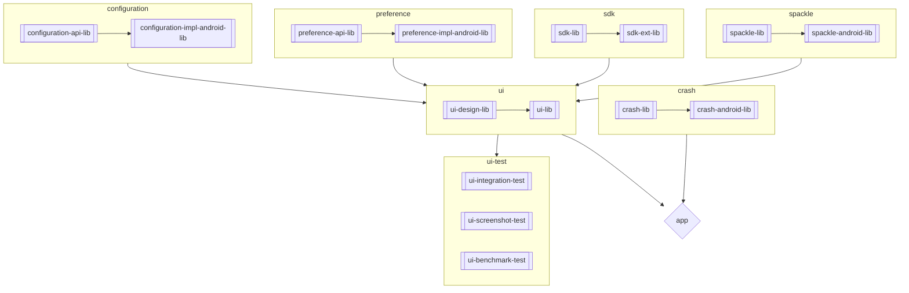

# Design and Architecture
_Note: This document will continue to be updated as the app is implemented._

# Gradle
 * Versions are declared in [gradle.properties](../gradle.properties).  There's still enough inconsistency in how versions are handled in Gradle, that this is as close as we can get to a universal system.  A version catalog is used for dependencies and is configured in [settings.gradle.kts](../settings.gradle.kts), but other versions like Gradle Plug-ins, the NDK version, Java version, and Android SDK versions don't fit into the version catalog model and are read directly from the properties
 * Much of the Gradle configuration lives in [build-conventions-secant](../build-conventions-secant/) to prevent repetitive configuration as additional modules are added to the project
 * Build scripts are written in Kotlin, so that a single language is used across build and the app code bases
 * Only Gradle, Google, and JetBrains plug-ins are included in the critical path.  Third party plug-ins can be used, but they're outside the critical path.  For example, the Gradle Versions Plugin could be removed and wouldn't negatively impact local building, testing, or releasing the app
 * Repository restrictions are enabled in [build-conventions-secant](../build-conventions-secant/settings.gradle.kts), [settings.gradle.kts](../settings.gradle.kts), and [build.gradle.kts](../build.gradle.kts) to reduce likelihood of pulling in an incorrect dependency.  If adding a new dependency, these restrictions may need to be changed otherwise an error that the dependency cannot be found will be displayed

# Multiplatform
While this repository is for an Android application, efforts are made to give multiplatform flexibility in the future.  Specific adaptions that are being made:
 * Where possible, common code is extracted into multiplatform modules.  This sometimes means that additional modules with an `-android` suffix exist to add Android-specific extensions.  In the future, we would like to move towards multiplatform modules with source directories along the lines of commonJvmMain, jvmMain, and androidMain.
 * In UI state management code, Kotlin Flow is often preferred over Android LiveData and Compose State to grant future flexibility
 * Saver is preferred over @Parcelize for objects in the SDK

Note: Test coverage for multiplatform modules behaves differently than coverage for Android modules.  Coverage is enabled by default for the JVM target when running `./gradlew check`.

# App
The main entrypoints of the application are:
 * [ZcashApplication.kt](../app/src/main/java/co/electriccoin/zcash/app/ZcashApplication.kt) - The root Application object defined in the app module
 * [MainActivity.kt](../ui-lib/src/main/java/co/electriccoin/zcash/ui/MainActivity.kt) - The main Activity, defined in ui-lib.  Note that the Activity is NOT exported.  Instead, the app module defines an activity-alias in the AndroidManifest which is what presents the actual icon on the Android home screen.

# Modules
The logical components of the app are implemented as a number of Gradle modules.

 * `app` — Compiles all the modules together into the final application.  This module contains minimal actual code.  Note that the Java package structure for this module is under `co.electriccoin.zcash.app` while the Android package name is `co.electriccoin.zcash`.
 * `build-info-lib` — Collects information from the build environment (e.g. Git SHA, Git commit count) and compiles them into the application.  Can also be used for injection of API keys or other secrets.
 * configuration
     * `configuration-api-lib` — Multiplatform interfaces for remote configuration.
     * `configuration-impl-android-lib` — Android-specific implementation for remote configuration storage.
 * crash — For collecting and reporting exceptions and crashes
     * `crash-lib` — Common crash collection logic for Kotlin and JVM.  This is not fully-featured by itself, but the long-term plan is multiplatform support.
     * `crash-android-lib` — Android-specific crash collection logic, built on top of the common and JVM implementation in `crash-lib`
 * ui
     * `ui-design` — Contains UI theme elements only. Besides offering modularization, this allows for hide of some Material Design components behind our own custom components.
     * `ui-lib` — User interface that the user interacts with.  This contains 99% of the UI code, along with localizations, icons, and other assets.
* ui-test
    * `ui-integration-test` — Is a pure test module dedicated for integration tests only. It has Android Test Orchestrator turned on — it allows us to run each of our tests within its own invocation of Instrumentation, and thus brings us benefits for the testing environment (minimal shared state, crashes are isolated, permissions are reset).
    * `ui-screenshot-test` — Is also a pure test module, whose purpose is to provide a wrapper for the ui screenshot tests. It has the Android Test Orchestrator turned on too.
    * `ui-benchmark-test` — Test module, which we use to run macrobenchmark tests against the `app` module. Benchmarking is a way to inspect and monitor the performance of our application. We regularly run benchmarks to help analyze and debug performance problems and ensure that we don't introduce regressions in recent changes.
 * preference
     * `preference-api-lib` — Multiplatform interfaces for key-value storage of preferences.
     * `preference-impl-android-lib` — Android-specific implementation for preference storage.
 * sdk
     * `sdk-ext-lib` — Contains extensions on top of the to the Zcash SDK.  Some of these extensions might be migrated into the SDK eventually, while others might represent Android-centric idioms.  Depending on how this module evolves, it could adopt another name such as `wallet-lib` or be split into two.
 * spackle — Random utilities, to fill in the cracks in the frameworks.
     * `spackle-lib` — Multiplatform implementation for Kotlin and JVM
     * `spackle-android-lib` — Android-specific additions.

The following diagram shows a rough depiction of dependencies between the modules.  Two notes on this diagram:
 * `sdk-lib` is in a [different repository](https://github.com/Electric-Coin-Company/zcash-android-wallet-sdk)
 * Although effort goes into ensuring this diagram stays up-to-date, Gradle build files are the authoritative source on dependencies

# Test Fixtures
Until the Kotlin adopts support for fixtures, fixtures live within the main source modules.  These fixtures make it easy to write automated tests, as well as create Compose previews.  Although these fixtures are compiled into the main application, they should be removed by R8 in release builds.

# Debugging
The application has support for remote configuration (aka feature toggles), which allows decoupling of releases from features being enabled.

Debug builds allow for manual override of feature toggle entries, which can be set by command line invocations.  These overrides last for the lifetime of the process, so they will reset if the process dies.  Pressing the home button on Android does not necessarily stop the process, so the best way to ensure process death is to choose Force Stop in the Android settings.

To set a configuration value manually, run the following shell command replacing `$SOME_KEY` and `$SOME_VALUE` with the key-value pair you'd like to set.  The change will take effect immediately.

`adb shell am broadcast -n co.electriccoin.zcash.debug/co.electriccoin.zcash.configuration.internal.intent.IntentConfigurationReceiver --es key "$SOME_KEY" --es value "$NEW_VALUE"`

As a specific example, the "Request ZEC" button on the home screen is currently disabled because the underlying functionality is not available yet.  The button can be shown by running the command:

`adb shell am broadcast -n co.electriccoin.zcash.debug/co.electriccoin.zcash.configuration.internal.intent.IntentConfigurationReceiver --es key "is_request_zec_enabled" --es value "true"`

# Shared Resources
There are some app-wide resources that share a common namespace, and these should be documented here to make it easy to ensure there are no collisions.

* Databases
    * Some databases are defined by the SDK
* Notification IDs
    * No notification IDs are currently defined
* Notification Channels
    * No notification channels are currently defined
* WorkManager Tags
    * "co.electriccoin.zcash.background_sync" is defined in `WorkIds.kt`
